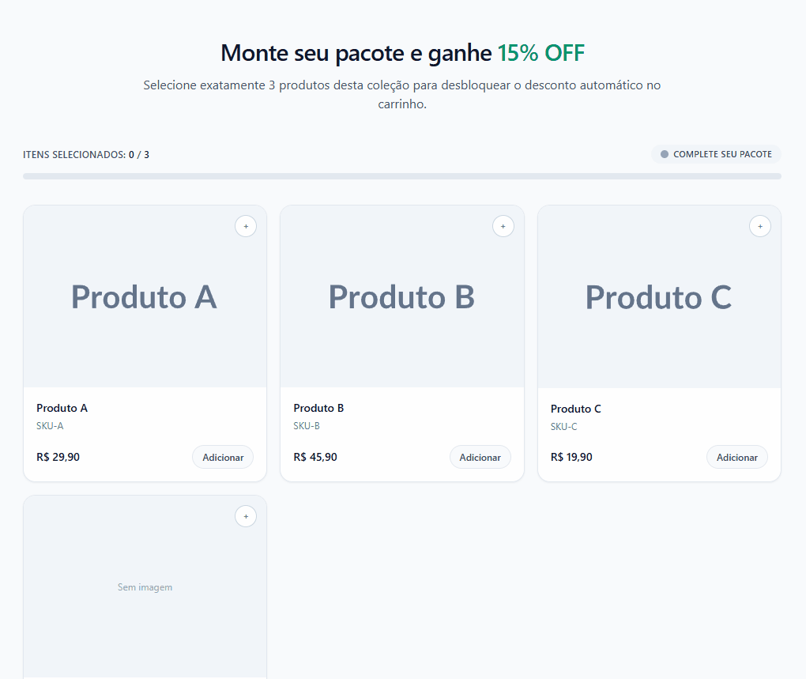

# Shopify Advanced Bundle Builder (PoC)

A high-performance, conversion-focused bundling solution for Shopify. This Proof of Concept (PoC) demonstrates how to extend Shopify's native features using a modern, lightweight frontend stack.

## Tech

- **Alpine.js** – reactive state, no build step
- **Tailwind CSS** – styling via CDN
- **Liquid** – Shopify sections/snippets
- **Shopify AJAX API** – `/cart/add.js` for multi-item add

## Features

- Select exactly N products to form a bundle (configurable 2–6 items)
- Automatic percentage discount (5–50%)
- Progress bar and real-time pricing
- Adds bundle to cart via Shopify `/cart/add.js`

## How to

**Preview locally**

1. Serve with a static server (e.g. Live Server in VS Code).
2. Open `index.html`.

Cart add will fail locally—that's expected.

**Use in Shopify**

1. Copy `sections/advanced-bundle-builder.liquid` into your theme's `sections/` folder.
2. In the theme editor: Add section → **Advanced Bundle Builder**.
3. Configure: pick a collection, set items count (2–6) and discount % (5–50).

## License

MIT. See [LICENSE](LICENSE).
